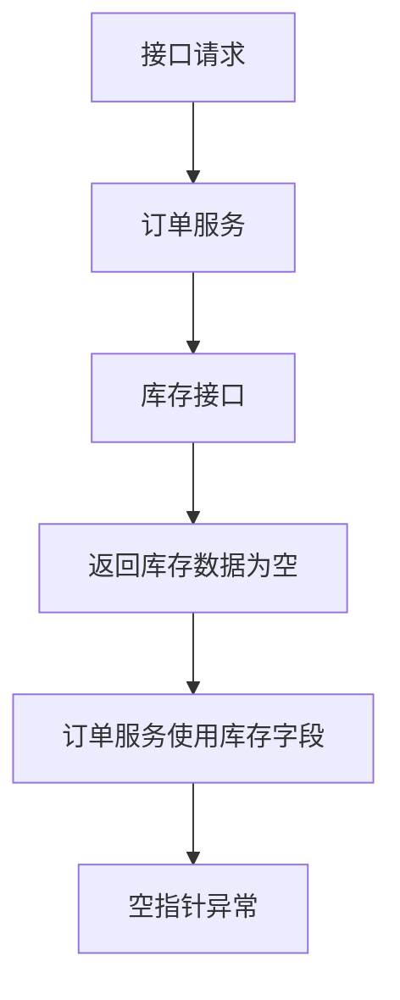

# JSH 问题排查

## 输入

必须提供：

- 环境：`dev`、`pre` 或 `prod`
- 至少一个线索：`requestId`、`message`/错误关键字、接口 `url`

可选提供：

- 生产代码 `tag`、commit SHA 或其它 GitLab `ref`
- 指定生产 `tag` 时必须同时提供工程名/服务名，例如 `jsh-service-purchase-order-sync tag=v1.2.3`

缺少环境或线索时先向用户确认。
如果用户只给生产 tag、没有给工程名/服务名，先向用户确认工程名；不要仅凭 tag 查询代码，因为各工厂/工程的生产 tag 相互独立，tag 名可能重复。

## 配置

使用两个 bundled Python 脚本：

- `scripts/query_sls_logs.py`：查询 SLS。脚本优先加载 `scripts/vendor/` 中的 bundled 依赖，通常可直接用系统 Python 运行。
- `scripts/query_gitlab_code.py`：通过 GitLab API 搜索项目、校验 ref、搜索代码和读取文件行；只使用 Python 标准库，不需要额外依赖。

配置文件放在 skill 根目录，不放在 `scripts/`。默认读取 `sls_config.json`；也可以用 `--config <config_path>` 指定。示例配置见 `sls_config.example.json`。

```json
{
  "gitlab": {
    "base_url": "https://git.haier.net",
    "token": "YOUR_GITLAB_PERSONAL_ACCESS_TOKEN"
  },
  "access_key_id": "...",
  "access_key_secret": "..."
}
```

GitLab token 只从 `sls_config.json` 的 `gitlab.token` 读取。不要读取环境变量，不要使用 `token_env`，不要在报告或日志中打印 token。

## 安全边界

严格禁止调用业务接口、HTTP API、RPC、数据库、Redis、消息队列、浏览器页面接口、curl/httpie/Postman、应用管理平台或其他云产品接口来获取返回值或复现问题。

允许的外部网络行为仅限两类：

- 通过 `scripts/query_sls_logs.py` 使用阿里云 SLS SDK 查询指定日志。
- 通过 `scripts/query_gitlab_code.py` 使用 GitLab API 读取项目元信息和目标代码文件。

禁止使用本地 `code_root`、全局文件系统搜索、`git fetch`、`git pull`、`git clone`、`git archive`、浅克隆或仓库临时目录。工程代码体量大时也只能按 GitLab API 逐文件、按行范围读取。

## 环境映射

| 环境 | Endpoint | Project | service-log | access-log | 默认 ref |
| --- | --- | --- | --- | --- | --- |
| `dev` | `cn-qingdao.log.aliyuncs.com` | `jsh-log-dev` | `service-log-dev` | `access-log-dev` | `dev` |
| `pre` | `cn-beijing.log.aliyuncs.com` | `jsh-log-pre-prod` | `service-log-pre` | `access-log-pre` | `master` |
| `prod` | `cn-beijing.log.aliyuncs.com` | `jsh-log-pre-prod` | `service-log-prod` | `access-log-prod` | `master` |

ref 选择优先级：

1. 用户指定的生产 tag、commit SHA 或 ref。
2. SLS 日志中可识别出的部署 tag、commit SHA 或版本 ref。
3. 用户指定的其它 ref。
4. 环境默认 ref。

用户明确给出 tag 时，必须先确定 GitLab 项目，再用 `verify-ref` 在该项目内校验 tag。如果 tag 不存在，不要停止代码分析；改用环境默认 ref 兜底：`dev` 用 `dev`，`pre`/`prod` 用 `master`。报告中必须说明“未找到指定 tag，实际基于 `<fallback-ref>` 分支分析”。如果用户没有给工程名/服务名，必须先确认工程名。

## SLS 查询

查询参数由智能体根据环境和线索分析后显式传入：`--endpoint`、`--project`、`--logstore`、`--query`、`--minutes`、`--line`、`--offset`。不要把这些查询参数写入配置文件。

默认倒序查询；脚本默认 `reverse=True`，只有明确需要时间正序时才传 `--forward`。

日志条数硬限制：每次最多 10 条。`--line <= 10`，查询语句里的 `limit <= 10`。

线索路径：

- `requestId` 或 `message`：查 `service-log`
- 接口 `url`：查 `access-log`
- 同时提供多种线索：先用 `requestId` 查 `service-log`；需要确认入口流量时再用 `url` 查 `access-log`

时间范围：

- `service-log` 默认最近 30 天：`--minutes 43200`
- `access-log` 默认最近 30 天：`--minutes 43200`

查询模板：

```bash
python scripts/query_sls_logs.py \
  --config "<config_path>" \
  --endpoint "<endpoint>" \
  --project "<project>" \
  --logstore "<logstore>" \
  --minutes 43200 \
  --line 10 \
  --offset 0 \
  --query 'requestid:"<requestId>" AND level:ERROR | select * limit 10' \
  --json
```

`requestId` 查询顺序：`ERROR` -> `WARN` -> 仅 `requestid`。

`message` 查询顺序：`message AND level:ERROR` -> `message AND level:WARN` -> 仅 `message`。

`url` 查询优先用 path 或稳定业务参数，不要把 token/signature/timestamp 作为唯一条件。优先：

```text
request_uri:"<url-or-path>" | select * limit 10
```

无结果时再尝试 `url`、`path`、`uri`、`request`、`log` 字段。

## 递进检索

一次查询不足以解释原因时，允许结合代码上下文和已有日志继续检索，最多执行 10 次 SLS 查询。每次追加查询都必须满足：

- 有明确目的，例如验证某个下游/外围接口请求响应、库存返回、订单号、业务 id、异常前置日志。
- 查询条件来自本次日志、GitLab 代码附近日志文本、业务 id、接口名、方法名或 requestId；不能盲目扩大范围。
- 如果业务逻辑被外围接口返回值校验拦截，必须优先补齐该外围接口的 `applicationname/projectname`、URI/path、方法/类、调用入参、返回出参、状态码和耗时；日志中缺字段时明确写“未记录”。
- 仍遵守最多 10 条、默认倒序、包含线索条件的限制。
- 在报告中记录“第 N 次查询”的目的和结论。

达到 10 次仍不能闭环时停止查询，报告缺口，不要继续无休止检索。

## GitLab 代码分析

只通过 `scripts/query_gitlab_code.py` 读取代码。脚本输出 JSON，命令失败时也输出结构化错误。

### 项目定位

优先从 SLS 日志提取 `applicationname` / `projectname` 作为服务名，再搜索 GitLab 项目：

```bash
python scripts/query_gitlab_code.py --config "<config_path>" search-project \
  --query "<service-name>"
```

- 若未查到项目，不猜仓库路径；报告“GitLab 未查询到项目”，继续仅基于 SLS 日志推理。
- 若用户指定生产 tag，必须使用用户明确给出的工程名/服务名定位项目；SLS 日志里的服务名只能作为校验信号，不能替代用户指定工程。
- 若命中多个项目，优先选择项目名或 `path_with_namespace` 与服务名精确匹配的项目。
- 仍不唯一时列出候选并停止代码分析，除非 SLS 日志能唯一确认服务名和命名空间。
- 若返回 `401/403`，报告 GitLab token 缺失、失效或无项目读取权限。
- 私有项目返回 `404` 时，按“项目不存在或无权限”处理，停止 GitLab 代码分析。

### ref 校验

确定 ref 后先校验可访问性：

```bash
python scripts/query_gitlab_code.py --config "<config_path>" verify-ref \
  --project-id "<project-id>" \
  --ref "<ref>"
```

`verify-ref` 会按 branch、tag、commit 依次校验。用户指定生产 tag 时，如果校验失败，按当前环境选择默认 ref 兜底并继续代码分析：测试环境 `dev` 使用 `dev`，预发/生产 `pre`、`prod` 使用 `master`。继续前再对兜底 ref 执行一次 `verify-ref`；若兜底 ref 也不可访问，再停止 GitLab 代码分析并报告缺口。

### 代码搜索与读取

先搜索类名、方法名、异常类、日志文本或关键业务符号：

```bash
python scripts/query_gitlab_code.py --config "<config_path>" search-code \
  --project-id "<project-id>" \
  --ref "<ref>" \
  --query "<class-or-symbol>"
```

再按路径读取必要行范围，避免把大文件全部放入上下文：

```bash
python scripts/query_gitlab_code.py --config "<config_path>" get-file \
  --project-id "<project-id>" \
  --ref "<ref>" \
  --path "src/main/java/.../Target.java" \
  --start-line 120 \
  --end-line 180
```

代码定位规则：

- 优先搜索堆栈类名、日志 `location`、异常类、接口 Controller、Service 方法名。
- 若搜索结果多个，只读取与 SLS 服务、包名、类名最匹配的候选；仍不唯一时报告候选并停止代码分析，不猜测。
- 读取 `pom.xml` 版本也使用 `get-file`；继承父版本时继续读取父级 `pom.xml`，无法定位则明确写缺口。
- 若 GitLab API 返回 `401/403/404`，报告代码证据缺失原因，停止 GitLab 代码分析。

## 输出

返回简洁报告：

- **请求信息**：环境、线索、时间范围
- **查询过程**：每次 SLS 查询的目的、条件、命中数、关键证据
- **SLS 证据**：`applicationname`、`location`、错误信息、堆栈、接口 path、状态码、耗时、关键请求/响应
- **外围接口证据**：当下游/外围接口返回值导致业务校验拦截时，列出接口服务、URI/path、方法/类、调用入参、返回出参、状态码、耗时；日志没有记录的字段明确写“未记录”
- **服务与版本**：服务/模块、GitLab ref、`pom.xml` 版本；父级 `pom.xml` 无法定位时写明缺口
- **GitLab 代码来源**：项目 ID、`path_with_namespace`、期望 ref、实际分析 ref、ref 类型、文件路径、API 状态；若指定 tag 不存在，明确提醒“未找到具体 tag 的代码”
- **代码路径**：文件、类、方法、行号范围
- **断点原因**：在哪个调用/数据/分支中断，为什么导致异常
- **流程图**：当存在多步调用、上下游或递进查询时，用 Mermaid 简易流程图标注断点原因
- **置信度/缺口**：缺少的日志、权限、配置、ref、项目或代码证据

流程图示例：



如果日志和 GitLab 代码支持明确结论，直接给结论；证据不足时说明缺什么。若代码不可读，明确标注“仅基于 SLS 日志推理，GitLab 代码证据缺失”并列出具体原因。
