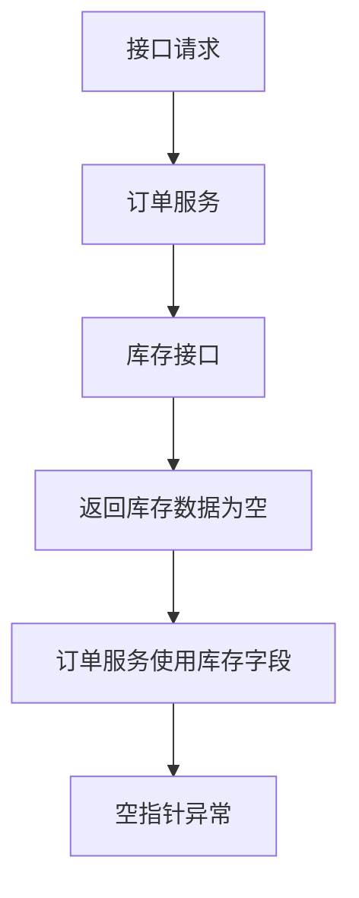

# JSH 问题排查

## 输入

必须提供：

- 环境：`dev`、`pre` 或 `prod`
- 至少一个线索：`requestId`、`message`/错误关键字、接口 `url`

缺少环境或线索时先向用户确认。

## 配置

使用 `scripts/query_sls_logs.py` 查询 SLS。脚本优先加载 `scripts/vendor/` 中的 bundled 依赖，通常可直接用系统 Python 运行；`scripts/requirements.txt` 仅用于更新或重建 vendor 依赖。

配置文件放在 skill 根目录，不放在 `scripts/`。`scripts/` 只保留可执行脚本、依赖声明和 vendor 依赖。配置文件只保存本地固定配置：

```json
{
  "code_root": "/path/to/jsh/code",
  "access_key_id": "...",
  "access_key_secret": "..."
}
```

默认读取 `sls_config.json`；也可以用 `--config <config_path>` 指定。示例配置见 `sls_config.example.json`。`code_root` 必须从配置读取，可以是单个 Git 仓库，也可以是包含多个服务仓库/源码目录的文件系统根目录。若 `code_root` 缺失或不是目录，不要在全局文件系统搜索代码库；本次排查降级为仅基于 SLS 日志推理，并在报告中说明代码证据缺失。

## 安全边界

严格禁止调用业务接口、HTTP API、RPC、数据库、Redis、消息队列、浏览器页面接口、curl/httpie/Postman、应用管理平台或其他云产品接口来获取返回值或复现问题。

允许的外部网络行为仅限两类：通过 `scripts/query_sls_logs.py` 使用阿里云 SLS SDK 查询指定日志；在已确认的 Git 仓库内执行 `git fetch` 更新远端 refs 以判断代码新鲜度。不要执行 `git pull`，不要让 Git 合并、变基或修改工作区。

## 环境映射

| 环境 | Endpoint | Project | service-log | access-log | 分支 |
| --- | --- | --- | --- | --- | --- |
| `dev` | `cn-qingdao.log.aliyuncs.com` | `jsh-log-dev` | `service-log-dev` | `access-log-dev` | `dev` |
| `pre` | `cn-beijing.log.aliyuncs.com` | `jsh-log-pre-prod` | `service-log-pre` | `access-log-pre` | `master` |
| `prod` | `cn-beijing.log.aliyuncs.com` | `jsh-log-pre-prod` | `service-log-prod` | `access-log-prod` | `master` |

## SLS 查询

查询参数由智能体根据环境和线索分析后显式传入：`--endpoint`、`--project`、`--logstore`、`--query`、`--minutes`、`--line`、`--offset`。不要把这些查询参数写入配置文件。

默认倒序查询；脚本默认 `reverse=True`，只有明确需要时间正序时才传 `--forward`。

日志条数硬限制：每次最多 10 条。`--line <= 10`，查询语句里的 `limit <= 10`。

线索路径：

- `requestId` 或 `message`：查 `service-log`
- 接口 `url`：查 `access-log`
- 同时提供多种线索：先用 `requestId` 查 `service-log`；需要确认入口流量时再用 `url` 查 `access-log`

时间范围：

- `service-log` 默认最近 30 天：`--minutes 43200`
- `access-log` 优先使用用户给出的具体时间范围；未提供时默认最近 24 小时：`--minutes 1440`

查询模板：

```bash
python scripts/query_sls_logs.py \
  --config "<config_path>" \
  --endpoint "<endpoint>" \
  --project "<project>" \
  --logstore "<logstore>" \
  --minutes 43200 \
  --line 10 \
  --offset 0 \
  --query 'requestid:"<requestId>" AND level:ERROR | select * limit 10' \
  --json
```

`requestId` 查询顺序：`ERROR` -> `WARN` -> 仅 `requestid`。

`message` 查询顺序：`message AND level:ERROR` -> `message AND level:WARN` -> 仅 `message`。

`url` 查询优先用 path 或稳定业务参数，不要把 token/signature/timestamp 作为唯一条件。优先：

```text
request_uri:"<url-or-path>" | select * limit 10
```

无结果时再尝试 `url`、`path`、`uri`、`request`、`log` 字段。

## 递进检索

一次查询不足以解释原因时，允许结合代码上下文和已有日志继续检索，最多执行 5 次 SLS 查询。每次追加查询都必须满足：

- 有明确目的，例如验证某个下游/外围接口请求响应、库存返回、订单号、业务 id、异常前置日志。
- 查询条件来自本次日志、代码附近日志文本、业务 id、接口名、方法名或 requestId；不能盲目扩大范围。
- 如果业务逻辑被外围接口返回值校验拦截，必须优先补齐该外围接口的 `applicationname/projectname`、URI/path、方法/类、调用入参、返回出参、状态码和耗时；日志中缺字段时明确写“未记录”。
- 仍遵守最多 10 条、默认倒序、包含线索条件的限制。
- 在报告中记录“第 N 次查询”的目的和结论。

示例：订单服务空指针发生在库存数据使用处；代码上下文发现调用库存接口前后打印了“库存查询返回”；则用该日志文本、订单 id 或 requestId 再查那一刻库存返回内容，用返回为空/字段缺失等证据形成明确结论。

达到 5 次仍不能闭环时停止查询，报告缺口，不要继续无休止检索。

## 代码分析

先读取配置中的 `code_root`。如果目录无效，跳过代码分析，不要搜索其他目录；仅根据日志证据输出推理和缺口。

如果 `code_root` 是 Git 仓库，直接把它作为代码仓库。如果 `code_root` 只是文件系统目录，允许仅在该目录内部定位代码，禁止全局搜索：

- 优先根据日志中的 `applicationname` / `projectname` 找同名目录，例如 `ylh-cloud-service-order`。
- 其次在 `code_root` 下一级或二级目录内查找 `.git`、`pom.xml`、`build.gradle`、`src/main`，结合日志里的类名、方法名、异常类或接口路径定位候选仓库/模块。
- 如果找到多个候选，选择能命中日志类名/方法名的仓库；仍不唯一时报告候选并降级为日志推理，不要猜测。
- 如果只找到源码目录但没有 `.git`，可以用 `rg`/文件读取做代码路径分析，但代码版本新鲜度标记为“无法确认，非 Git 仓库或未定位到 Git 仓库”。

如果定位到 Git 仓库，先记录本地工作区和目标分支状态：

```bash
git -C "<repo_dir>" status --short --branch
git -C "<repo_dir>" fetch --prune
git -C "<repo_dir>" rev-parse --abbrev-ref HEAD
git -C "<repo_dir>" rev-parse "<target_branch>"
git -C "<repo_dir>" rev-parse "origin/<target_branch>"
git -C "<repo_dir>" log -1 --format="%H %ci %s" "<target_branch>"
git -C "<repo_dir>" log -1 --format="%H %ci %s" "origin/<target_branch>"
```

不要覆盖、回退、暂存或丢弃用户改动。若仓库不在 `code_root` 根目录，所有 `git -C` 命令使用定位到的仓库目录。优先只读检查目标分支：

```bash
git -C "<repo_dir>" grep "<symbol>" master
git -C "<repo_dir>" show master:path/to/pom.xml
git -C "<repo_dir>" grep "<symbol>" dev
git -C "<repo_dir>" show dev:path/to/pom.xml
```

`dev` 分析 `dev`；`pre`/`prod` 分析 `master`。从相关模块 `pom.xml` 推断版本；继承父版本时继续读取父级 `pom.xml`。

代码版本新鲜度判断：

- 仅当定位到 Git 仓库时才执行 `git fetch --prune` 更新远端 refs；如果 fetch 失败，报告“无法确认代码新鲜度”，并说明失败原因。
- 不执行 `git pull`；只比较本地目标分支和 `origin/<target_branch>`，不要合并、变基或修改工作区。
- 如果本地 `<target_branch>` 与 `origin/<target_branch>` commit 不一致，优先用 `git show origin/<target_branch>:<path>` / `git grep <symbol> origin/<target_branch>` 分析远端最新代码，并在报告中说明本地分支落后或不一致。
- 不要把未提交、已暂存、未跟踪文件作为已部署行为依据；除非它们和日志问题直接相关，否则只作为工作区状态报告。

## 输出

返回简洁报告：

- **请求信息**：环境、线索、时间范围
- **查询过程**：每次 SLS 查询的目的、条件、命中数、关键证据
- **SLS 证据**：`applicationname`、`location`、错误信息、堆栈、接口 path、状态码、耗时、关键请求/响应
- **外围接口证据**：当下游/外围接口返回值导致业务校验拦截时，列出接口服务、URI/path、方法/类、调用入参、返回出参、状态码、耗时；日志没有记录的字段明确写“未记录”
- **服务与版本**：服务/模块、分支、`pom.xml` 版本
- **代码版本状态**：本地目标分支 commit、最后提交时间、是否能确认新鲜度；无法确认时明确说明
- **代码路径**：文件、类、方法
- **断点原因**：在哪个调用/数据/分支中断，为什么导致异常
- **流程图**：当存在多步调用、上下游或递进查询时，用 Mermaid 简易流程图标注断点原因
- **置信度/缺口**：缺少的日志、权限、配置、分支或代码证据

流程图示例：



如果日志和代码支持明确结论，直接给结论；证据不足时说明缺什么。若 `code_root` 不可用，明确标注“仅基于日志推理，未做本地代码分析”。若 `code_root` 可用但未定位到 Git 仓库，明确标注“已基于文件系统做代码分析，未确认 Git 版本新鲜度”。
